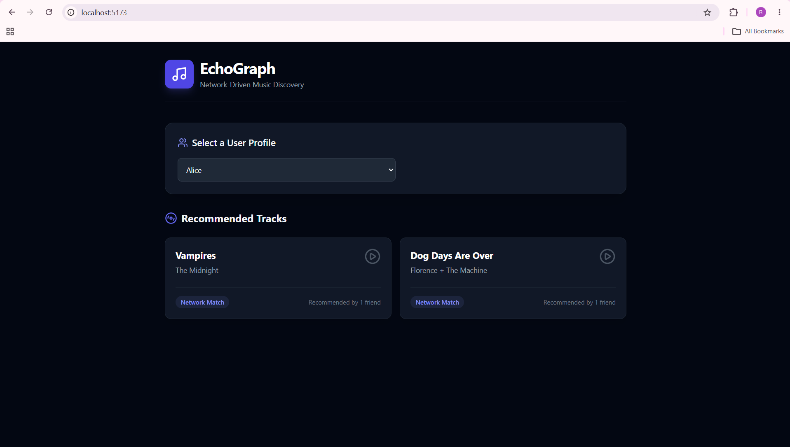

# EchoGraph 🎵 — Network-Driven Music Discovery

EchoGraph is a full-stack web application backed by **CognoDB**, a managed graph database. It allows users to discover new music based on the real-time listening habits of their social network, rather than relying on generic, global algorithms.

## 🚀 Live Demo

👉 **[Open EchoGraph Live Demo](https://echograph-cognodb.vercel.app/)**

## 🎥 Demo Video

[Watch the EchoGraph Demo](https://drive.google.com/file/d/1bepwGY4FdAdZuQgfULOO_gyFSl4QuF4m/view?usp=sharing)



---

## 💡 Why a Graph Database?

Relational databases (SQL) are highly efficient for tabular data, but they struggle when queried for deeply connected, multi-hop relationships. If we were to build EchoGraph using SQL, the data would be fragmented across multiple tables (`Users`, `Follows`, `User_Tracks`, `Tracks`, `Artists`).

Executing a collaborative recommendation like:

> _"Find tracks listened to by people I follow, which I haven't listened to yet, ordered by how many of my friends listen to them."_

In a relational database, this requires **complex, resource-intensive `JOIN` operations** and subqueries across massive mapping tables. As the network grows, this query becomes exponentially slower and harder to maintain.

**The Graph Advantage:**
By using **CognoDB (OpenCypher)**, relationships are treated as first-class citizens.

1. **Multi-Hop Traversal:** Navigating the network `(User)-[:FOLLOWS]->(Friend)-[:LISTENS_TO]->(Track)-[:BY]->(Artist)` is a lightweight graph traversal that follows physical memory pointers, executing in milliseconds regardless of overall dataset size.
2. **Native Anti-Joins:** Excluding tracks the current user has already heard is natively handled using intuitive list comprehensions and set evaluations.
3. **Flexible Schema:** Adding new interactions in the future (e.g., `LIKES`, `PLAYLISTS`) requires no rigid schema migrations.

---

## 📐 Graph Data Model

Below is the graph schema modeled inside CognoDB:

```text
 (User: Alice) ──[:FOLLOWS]──> (User: Bob) ──[:LISTENS_TO]──> (Track: Vampires) ──[:BY]──> (Artist: The Midnight)
      │                                                                                           │
      └──[:LISTENS_TO]──> (Track: Sunset)                                                         └──[:BELONGS_TO]──> (Genre: Synth Pop)
```

### Node Labels & Properties

- `User`: `{userId: String, name: String}`
- `Track`: `{trackId: String, title: String}`
- `Artist`: `{artistId: String, name: String}`
- `Genre`: `{id: String, name: String}`

### Relationship Types

- `(:User)-[:FOLLOWS]->(:User)`
- `(:User)-[:LISTENS_TO {playCount: Integer}]->(:Track)`
- `(:Track)-[:BY]->(:Artist)`
- `(:Artist)-[:BELONGS_TO]->(:Genre)`

---

## 🔍 Core Cypher Queries Explained

### 1. The Multi-Hop Collaborative Recommendation Query

This query performs a multi-hop graph traversal to find music recommendations from the user's network. It uses a memory-safe list comprehension to filter out tracks the user has already heard—an optimization specifically designed for the 256MB RAM limit of the free tier instance.

```cypher
MATCH (u:User {userId: $userId})-[:FOLLOWS]->(friend:User)
MATCH (friend)-[:LISTENS_TO]->(t:Track)
MATCH (t)-[:BY]->(a:Artist)

// Group the matches and count how many friends listen to the track
WITH u, t, a, count(DISTINCT friend) AS recommendedBy

// Build a list of tracks the current user ALREADY listens to
WITH u, t, a, recommendedBy,
     [(u)-[:LISTENS_TO]->(myTrack:Track) | myTrack.trackId] AS myTracks

// Anti-Join: Only keep tracks that are NOT in the user's existing list
WHERE NOT t.trackId IN myTracks

RETURN
    t.trackId AS trackId,
    t.title AS track,
    a.name AS artist,
    recommendedBy
ORDER BY recommendedBy DESC
```

---

## 🚀 Setup & Installation Guide

### Prerequisites

- Node.js (v18 or higher)
- A free CognoDB Cloud Account ([console.cognodb.com](https://console.cognodb.com/signup))

### 1. Provision CognoDB Instance

1. Go to [console.cognodb.com](https://console.cognodb.com/signup) and create a free account.
2. Provision a free (`c0`) instance (takes < 1 minute).
3. Save your generated connection URI (`bolt+s://...`) and password.

### 2. Backend Setup

Navigate to the backend directory and install dependencies:

```bash
cd backend
npm install
```

Create a `.env` file inside the `backend` folder and add your CognoDB credentials:

```env
PORT=5000
NEO4J_URI=bolt+s://<your-instance-id>.databases.cognodb.cloud
NEO4J_USERNAME=cognodb
NEO4J_PASSWORD=<your-generated-password>
```

Seed the database with the initial graph network data:

```bash
node scripts/seed.js
```

Start the backend API server:

```bash
npm run dev
```

### 3. Frontend Setup

Open a new terminal window, navigate to the frontend directory, and start the React app:

```bash
cd frontend
npm install
npm run dev
```

Navigate to `http://localhost:5173` in your browser to explore the application!

---

## 🛠️ Tech Stack

- **Database:** CognoDB (Managed Graph DB, Bolt Protocol v5, OpenCypher)
- **Backend:** Node.js, Express.js, Official `neo4j-driver` for JavaScript
- **Frontend:** React.js (Vite), Tailwind CSS, Lucide Icons
